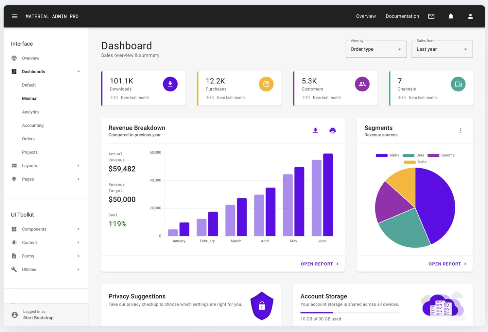

# TIM-ADMIN-UI
Admin frontend of timtube-api that's currently running. The following image is an example of how it will
look.

## Description
Tim-admin-ui allows an admin of timtube to interact with the system in performing the following actions:
+ Login and out.
+ Upload videos to the system.
+ Update video details.
+ Activate a video to be on the channel
+ Activate agents.
+ Deactivate agent.

## Available Scripts

In the project directory, you can run:

### `npm start`

Runs the app in the development mode.\
Open [http://localhost:3000](http://localhost:3000) to view it in your browser.

The page will reload when you make changes.\
You may also see any lint errors in the console.

### `npm test`

Launches the test runner in the interactive watch mode.\
See the section about [running tests](https://facebook.github.io/create-react-app/docs/running-tests) for more information.

### `npm run build`

Builds the app for production to the `build` folder.\
It correctly bundles React in production mode and optimizes the build for the best performance.

The build is minified and the filenames include the hashes.\
Your app is ready to be deployed!

See the section about [deployment](https://facebook.github.io/create-react-app/docs/deployment) for more information.

### `npm run eject`

**Note: this is a one-way operation. Once you `eject`, you can't go back!**

If you aren't satisfied with the build tool and configuration choices, you can `eject` at any time. This command will remove the single build dependency from your project.

Instead, it will copy all the configuration files and the transitive dependencies (webpack, Babel, ESLint, etc) right into your project so you have full control over them. All of the commands except `eject` will still work, but they will point to the copied scripts so you can tweak them. At this point you're on your own.

You don't have to ever use `eject`. The curated feature set is suitable for small and middle deployments, and you shouldn't feel obligated to use this feature. However we understand that this tool wouldn't be useful if you couldn't customize it when you are ready for it.

## Bootstrap

We are using React-Bootstrap. You should import individual components like: react-bootstrap/Button rather than the entire library. Doing so pulls in only the specific components that you use, which can significantly reduce the amount of code you end up sending to the client.

 ` import Button from 'react-bootstrap/Button';`

 ` import { Button } from 'react-bootstrap';`
 
Use the following link to get bootstrap components and learn how to use react-bootstrap.
https://react-bootstrap.github.io/components/alerts/

## React-Router-Dom
React Router enables "client side routing".
For more explanations please follow the link below.

https://reactrouter.com/en/main/start/overview

## React icon
React-icons is a small library that helps you add icons (from all different icon libraries) 
to your React apps. It delivers the icons to your app as components so they're easier to work 
with, and it lets you style them, so they're consistent with the overall style of your app.

Read how to use it.

https://www.freecodecamp.org/news/how-to-use-react-icons/
Where you can find icons,

https://react-icons.github.io/react-icons/icons?name=fa

